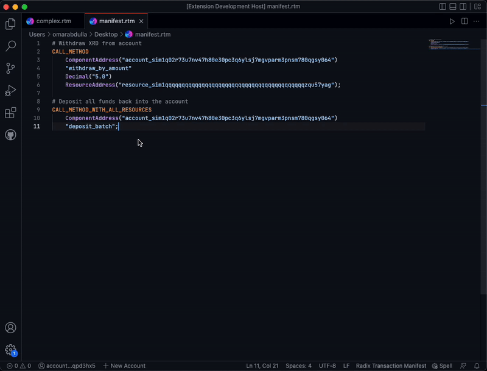
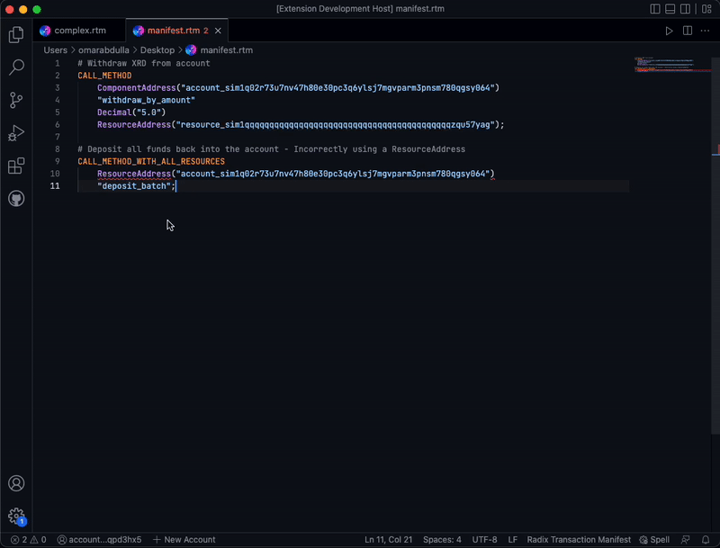

# Radix Transaction Manifest extension for Visual Studio Code

  

This is a Visual Studio code that provides a number of useful language features to Radix transaction manifests, adding features such as:

* ID Validation.
* Hover information and examples for instructions.
* Syntax Highlighting & Diagnostics.
* Formatting. 
* Snippets for common instructions.
* and more!

## Features

### ID Validation

When the manifest is first opened and when it is saved, the Id validator runs to check that all resource movements are correct. When a resource movement is found to be incorrect, the extension highlights the specific `Bucket` or `Proof` involved in this movement and provides the user with a clear message describing what the issue is. The following is a non-exhaustive list of some of things the Id validator is able to catch and warn the user about:

* When there is a dangling bucket by the end of the transaction.
* When a bucket or proof is attempted to be used twice. 
* When a bucket or proof is used but does not exist. 

The following GIF showcases one of errors provided by the Id validator to the user. In the case below, the Id validator picked up on the fact that there was an attempt to use `Bucket("my_xrd")` twice. Therefore, the Id validator emitted an error to the user letting them know of that.

  

### Hover Information and Examples for Instructions

The extension provides on-hover information for all of the transaction manifest instructions in the transaction manifest specification. The hover information provided usually includes the name of the instruction, the operations that it performs, the number of argument that is expected for this instruction, the potential returns of the instruction, an example of how the instruction can be used, as well as any relevant notes that developers should be aware of. 

All of this information is available once you hover over an instruction. The following GIF showcases what the on-hover information for the `CALL_METHOD_WITH_ALL_RESOURCES` instruction looks like.

  

### Syntax Highlighting & Diagnostics

As seen in the two previous images, the extension provides beautiful syntax highlighting to your manifest files which allows for instructions, to be easily distinguishable from values, and for literals to be distinguishable from all other items. 

In addition to syntax highlighting, the extension is able to provide errors when certain syntax errors are made. As an example, the extension is able to provide an error when a user attempts to perform a `CALL_METHOD` on a `ResourceAddress` or attempts to perform a `CLONE_PROOF` on a bucket. Such operations are syntactically incorrect and can be caught by the extension and reported to the user. 

The above mentioned are two out of many errors that the extension is able to catch and report to the user. The extension is able to do that as underneath the hood there is a parser and lexer that attempt to make sense of the transaction manifest, when either of them fails to make sense of the text, an error is emitted to the user.

The following GIF shows an example of a case where a `CALL_METHOD_WITH_ALL_RESOURCES` instruction is called with the first argument being a `ResourceAddress` instead of a `ComponentAddress` and the errors shown when that happens.

  

