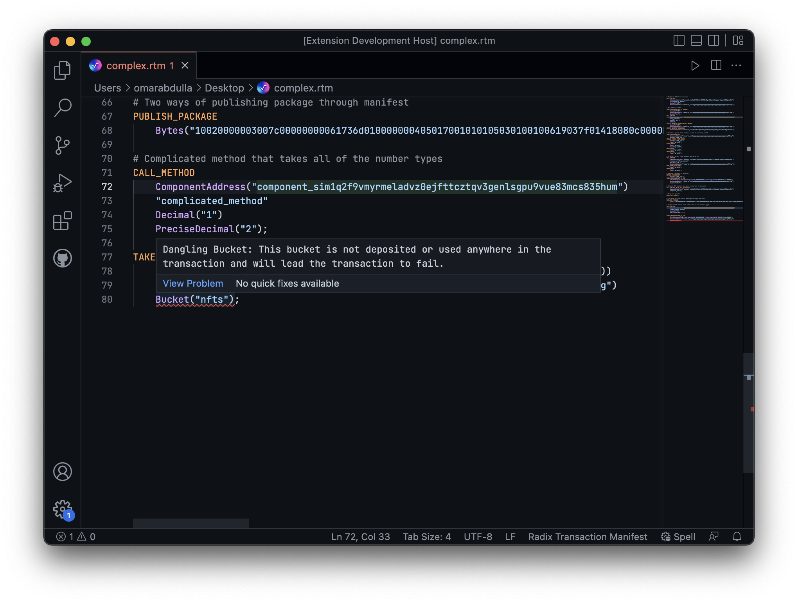
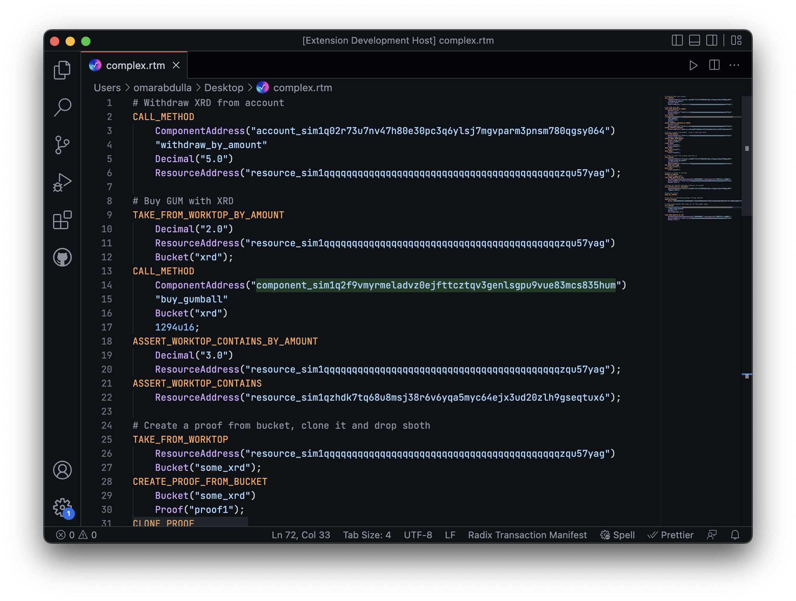

# Radix Transaction Manifest extension for Visual Studio Code

  

This Visual Studio Code extension adds a number of useful language IDE features to Radix Transaction Manifests. These features include:

* Diagnostics and Error Detection.
* Instruction Snippets.
* Syntax Highlighting & Formatting.
* Hover Information.
* and more!

# Features

## Diagnostics and Error Detection

  

This extension is able to detect a wide-array of errors in transaction manifests and provide warnings and errors when these errors are encountered. This is done through a number of `DiagnosticsProvider`s which provide diagnostics for different types of errors. The following is a list of the diagnostics providers currently available in the extension:

* **ID Validation Diagnostics Provider:** statically analyzes the transaction manifest and keeps track of buckets and proofs as they come into existence and they get used up. This provider catches errors involving buckets and proofs that get used twice, get used before coming into existence, or are left dangling in the transaction worktop in the end of the transaction.

* **Lexing and Parsing Diagnostics Provider:** lexes and parses the transaction manifest and reports back any errors involving the syntax of the transaction manifest or unexpected tokens. This diagnostics provider catches errors such as a `CALL_METHOD` happening on a resource address instead of a component address.

* **Addressing Diagnostics Provider:** analyzes all instances of addresses checking for their correctness in relation to Bech32 and overall sensibility. As an example, this provider is able to catch errors where a `PackageAddress` is used but the string is of a component address. Additionally, addresses with invalid Bech32m encoding, invalid entity bytes, or unconforming network specifiers can be picked up by this diagnostics provider. 

* **Numbers Diagnostics Provider:** analyzes all numbers used in the transaction manifest checking the limits of each of the numbers and the number of decimal places allowed, this provider then picks up on all numbers that are in violation of their rules. As an example, this provider is what provides diagnostics when a number such as "1233u8" is in the manifest.

* **General Diagnostics Provider:** general or miscellaneous diagnostics on multiple parts of transaction manifests.

Diagnostics providers are very modular and more diagnostics providers can be added later to add additional error reporting for other 

## Instruction Snippets

The extension comes with a number of snippets which make the process of writing transaction manifests far easier. The following are the snippets provided by this extension:

<table>
   <thead>
      <tr>
         <th>Category</th>
         <th>Snippet Trigger</th>
         <th>Description</th>
      </tr>
   </thead>
   <tbody>
      <tr>
         <td rowspan=22>Instruction Snippets</td>
         <td>CALL_METHOD</td>
         <td>Calls a method on a component</td>
      </tr>
      <tr>
         <td>CALL_METHOD</td>
         <td>Calls a method on a component</td>
      </tr>
      <tr>
         <td>CALL_METHOD</td>
         <td>Calls a method on a component.</d>
      </tr>
      <tr>
         <td>CALL_FUNCTION</td>
         <td>Calls a function on a blueprint.</d>
      </tr>
      <tr>
         <td>TAKE_FROM_WORKTOP</td>
         <td>Takes resources from the worktop and into a bucket.</d>
      </tr>
      <tr>
         <td>TAKE_FROM_WORKTOP_BY_AMOUNT</td>
         <td>Takes resources from the worktop and into a bucket.</d>
      </tr>
      <tr>
         <td>TAKE_FROM_WORKTOP_BY_IDS</td>
         <td>Takes resources from the worktop and into a bucket.</d>
      </tr>
      <tr>
         <td>RETURN_TO_WORKTOP</td>
         <td>Returns a bucket to the transaction worktop.</d>
      </tr>
      <tr>
         <td>ASSERT_WORKTOP_CONTAINS</td>
         <td>Asserts that the transaction worktop contains some resource.</d>
      </tr>
      <tr>
         <td>ASSERT_WORKTOP_CONTAINS_BY_AMOUNT</td>
         <td>Asserts that the transaction worktop contains some resource.</d>
      </tr>
      <tr>
         <td>ASSERT_WORKTOP_CONTAINS_BY_IDS</td>
         <td>Asserts that the transaction worktop contains some resource.</d>
      </tr>
      <tr>
         <td>POP_FROM_AUTH_ZONE</td>
         <td>Pops a proof from the Auth Zone.</d>
      </tr>
      <tr>
         <td>PUSH_TO_AUTH_ZONE</td>
         <td>Pushes a proof to the auth zone.</d>
      </tr>
      <tr>
         <td>CREATE_PROOF_FROM_AUTH_ZONE</td>
         <td>Creates a proof from the Auth Zone.</d>
      </tr>
      <tr>
         <td>CREATE_PROOF_FROM_AUTH_ZONE_BY_AMOUNT</td>
         <td>Creates a proof from the Auth Zone.</d>
      </tr>
      <tr>
         <td>CREATE_PROOF_FROM_AUTH_ZONE_BY_IDS</td>
         <td>Creates a proof from the Auth Zone.</d>
      </tr>
      <tr>
         <td>CREATE_PROOF_FROM_BUCKET</td>
         <td>Creates a proof from Bucket.</d>
      </tr>
      <tr>
         <td>CLONE_PROOF</td>
         <td>Clones an existing proof.</d>
      </tr>
      <tr>
         <td>DROP_PROOF</td>
         <td>Drops a Proof.</d>
      </tr>
      <tr>
         <td>DROP_ALL_PROOF</td>
         <td>Drops all Proofs.</d>
      </tr>
      <tr>
         <td>CLEAR_AUTH_ZONE</td>
         <td>Drops all proofs from the Auth Zone.</d>
      </tr>
      <tr>
         <td>PUBLISH_PACKAGE</td>
         <td>Publishes a package.</d>
      </tr>
      <tr>
         <td rowspan=4>Common Operations</td>
         <td>LOCK_FEE</td>
         <td>Locks a fee for the transaction.</td>
      </tr>
      <tr>
         <td>WITHDRAW_FROM_ACCOUNT</td>
         <td>Withdraws funds from an account.</td>
      </tr>
      <tr>
         <td>WITHDRAW_FROM_ACCOUNT_BY_AMOUNT</td>
         <td>Withdraws funds from an account.</td>
      </tr>
      <tr>
         <td>WITHDRAW_FROM_ACCOUNT_BY_IDS</td>
         <td>Withdraws funds from an account.</td>
      </tr>
      <tr>
         <td rowspan=4>Useful Constants</td>
         <td>RADIX_TOKEN</td>
         <td>The Resource Address of the Radix Token.</td>
      </tr>
      <tr>
         <td>SYSTEM_COMPONENT</td>
         <td>The component address of the system component.</td>
      </tr>
   </tbody>
</table>

## Syntax Highlighting and Formatting

  

The extension adds grammar and syntax rules for transaction manifest files which allows for syntax highlighting and native formatting integration with VS Code. 

# Installation Guide

## Option 1: Install through VS Code marketplace

Coming soon!

## Option 2: Installing through the .vsix file

Each new version that releases of this extension comes with pre-packaged vsix files which can be used to install this extension without needing to go through the VS Code marketplace. To install this extension through the vsix files, follow the steps below:

1. Install the vsix files of the latest release from [here](https://github.com/radixdlt/radix-transaction-manifest-extension/releases).
2. Open VS Code and go to the extensions tab.
3. Click on the three dots at the top right of the extensions tab. 
4. Click on "install from VSIX" and select the file that you downloaded.

## Option 3: Building/Packaging from Source

If you would like to build and package your own extension from source for the purpose of installing it, then follow the steps below:

1. In your command line, run the command: `vsce package`. This packages the extension for you in a vsix file. 
2. Follow the steps in "Option 2" above to install the vsix file you packaged. 