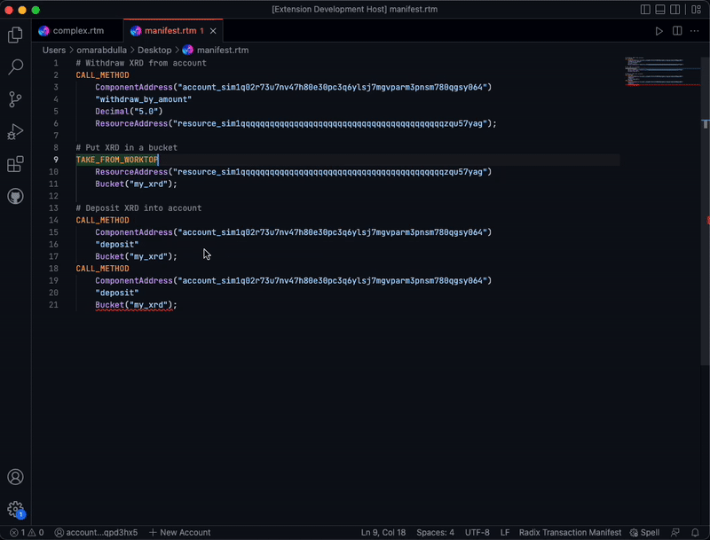

# Radix Transaction Manifest extension for Visual Studio Code

  

This is a Visual Studio code that provides a number of useful language features to Radix transaction manifests, adding features such as:

* ID Validation.
* Hover information and examples for instructions.
* Syntax Highlighting & Diagnostics.
* Formatting. 
* Snippets for common instructions.
* and more!

## Features

### ID Validation

When the manifest is first opened and when it is saved, the Id validator runs to check that all resource movements are correct. When a resource movement is found to be incorrect, the extension highlights the specific `Bucket` or `Proof` involved in this movement and provides the user with a clear message describing what the issue is. The following is a non-exhaustive list of some of things the Id validator is able to catch and warn the user about:

* When there is a dangling bucket by the end of the transaction.
* When a bucket or proof is attempted to be used twice. 
* When a bucket or proof is used but does not exist. 

The following GIF one of errors provided by the Id validator to the user. In the case below, the Id validator picked up on the fact that there was an attempt to use `Bucket("my_xrd")` twice. Therefore, the Id validator emitted an error to the user letting them know of that.

  

